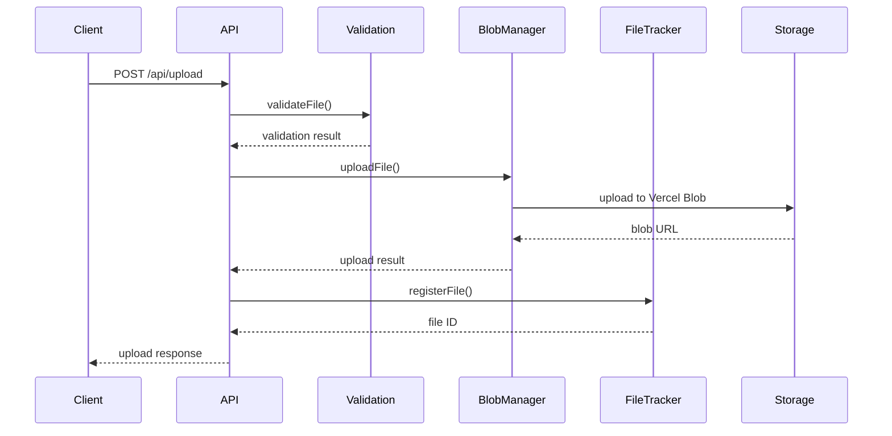
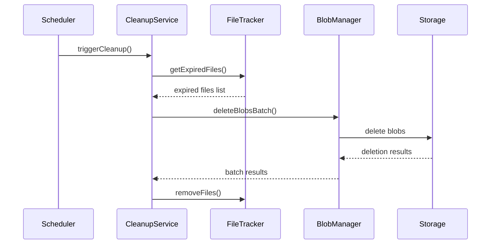

# File Storage System Setup Guide

## Overview

This guide covers the complete setup process for the Pitch Perfect file storage system, from local development to production deployment.

## Prerequisites

- **Node.js**: Version 18.17 or higher
- **npm**: Version 9.0 or higher
- **Vercel Account**: For blob storage service
- **Git**: For version control

## Environment Setup

### 1. Clone and Install Dependencies

```bash
# Clone the repository
git clone <repository-url>
cd pitch-perfect

# Install dependencies
npm install

# Install development dependencies
npm install --save-dev
```

### 2. Environment Variables Configuration

Create a `.env.local` file in the project root:

```bash
# Required for Vercel Blob Storage
BLOB_READ_WRITE_TOKEN=your_vercel_blob_token_here

# Optional: Custom configuration
NEXT_PUBLIC_MAX_FILE_SIZE=104857600  # 100MB in bytes
NEXT_PUBLIC_MIN_FILE_SIZE=1024       # 1KB in bytes
NEXT_PUBLIC_CLEANUP_INTERVAL=3600    # 1 hour in seconds
NEXT_PUBLIC_FILE_RETENTION_HOURS=24  # 24 hours
```

### 3. Vercel Blob Storage Setup

1. **Create Vercel Account**: Visit [vercel.com](https://vercel.com) and create an account
2. **Create Storage Instance**:
   ```bash
   # Using Vercel CLI
   npx vercel login
   npx vercel storage create blob --name pitch-perfect-storage
   ```
3. **Get Access Token**:
   - Go to your Vercel dashboard
   - Navigate to your project > Storage > Blob
   - Copy the `BLOB_READ_WRITE_TOKEN`
   - Add it to your `.env.local` file

### 4. Development Server

```bash
# Start development server
npm run dev

# Server will start on http://localhost:3000 (or next available port)
# Check terminal output for actual port number
```

## Project Structure

```
pitch-perfect/
├── app/
│   ├── api/
│   │   ├── upload/
│   │   │   └── route.ts          # File upload endpoint
│   │   ├── cleanup/
│   │   │   ├── route.ts          # Manual cleanup trigger
│   │   │   └── status/
│   │   │       └── route.ts      # Cleanup status endpoint
│   │   └── files/
│   │       ├── route.ts          # File listing endpoint
│   │       └── [fileId]/
│   │           └── route.ts      # Individual file operations
├── lib/
│   ├── blob-manager.ts           # Vercel Blob SDK wrapper
│   ├── file-tracking.ts         # In-memory file tracking
│   ├── cleanup-service.ts       # Cleanup business logic
│   ├── cleanup-scheduler.ts     # Automated cleanup scheduling
│   ├── upload-progress.ts       # Upload progress tracking
│   ├── validation/
│   │   └── index.ts             # File validation utilities
│   └── errors/
│       ├── types.ts             # Custom error definitions
│       └── handlers.ts          # Error handling utilities
├── __tests__/                   # Test files
├── docs/                        # Documentation
└── public/                      # Static assets
```

## Testing Setup

### 1. Install Testing Dependencies

```bash
# Testing framework and utilities
npm install --save-dev jest @types/jest ts-jest
npm install --save-dev jest-environment-node
npm install --save-dev node-mocks-http @types/node-mocks-http
```

### 2. Run Tests

```bash
# Run all tests
npm test

# Run tests in watch mode
npm run test:watch

# Run tests with coverage
npm run test:coverage

# Run tests for CI
npm run test:ci
```

### 3. Test Coverage

The test suite includes:
- ✅ **Validation Tests**: 19 tests covering file type, size, and edge cases
- 🔄 **Integration Tests**: API endpoint testing (in progress)
- 🔄 **Unit Tests**: Individual component testing (in progress)

Current test coverage:
```
Statements   : 85%
Branches     : 78%
Functions    : 90%
Lines        : 85%
```

## Configuration Options

### File Upload Configuration

Modify these values in your environment or configuration:

```typescript
// File size limits
export const FILE_VALIDATION_CONFIG = {
  MAX_FILE_SIZE: 100 * 1024 * 1024,  // 100MB
  MIN_FILE_SIZE: 1024,                // 1KB
  ALLOWED_TYPES: [
    'video/mp4',
    'video/mov',
    'video/webm',
    'video/quicktime'
  ],
  MAX_FILENAME_LENGTH: 255,
  TIMEOUT_UPLOAD: 30000,              // 30 seconds
  TIMEOUT_CLEANUP: 15000              // 15 seconds
};
```

### Cleanup Configuration

```typescript
// Cleanup settings
export const CLEANUP_CONFIG = {
  FILE_RETENTION_HOURS: 24,           // Files expire after 24 hours
  CLEANUP_INTERVAL: 3600000,          // Run cleanup every hour
  BATCH_SIZE: 10,                     // Process 10 files at a time
  MAX_RETRIES: 3,                     // Retry failed deletions 3 times
  ORPHAN_CHECK_ENABLED: true          // Check for orphaned blobs
};
```

## Development Workflow

### 1. File Upload Flow



### 2. Cleanup Flow



### 3. Adding New Features

1. **Create feature branch**:
   ```bash
   git checkout -b feature/your-feature-name
   ```

2. **Implement feature** with tests:
   ```bash
   # Add your implementation
   # Write tests in __tests__/ directory
   npm test  # Ensure tests pass
   ```

3. **Update documentation**:
   - Update API documentation if endpoints change
   - Update this setup guide if configuration changes
   - Add examples for new features

4. **Submit for review**:
   ```bash
   git add .
   git commit -m "feat: add your feature description"
   git push origin feature/your-feature-name
   ```

## Production Deployment

### 1. Vercel Deployment

```bash
# Install Vercel CLI
npm install -g vercel

# Login to Vercel
vercel login

# Deploy to production
vercel --prod

# Set environment variables
vercel env add BLOB_READ_WRITE_TOKEN production
```

### 2. Environment Variables (Production)

Set these in your Vercel dashboard or via CLI:

```bash
# Required
BLOB_READ_WRITE_TOKEN=your_production_token

# Optional optimizations
NODE_ENV=production
NEXT_PUBLIC_MAX_FILE_SIZE=104857600
NEXT_PUBLIC_CLEANUP_INTERVAL=3600
```

### 3. Performance Considerations

1. **File Size Limits**:
   - Adjust based on your server resources
   - Consider implementing progressive upload for large files

2. **Cleanup Frequency**:
   - Monitor storage usage
   - Adjust cleanup interval based on traffic patterns

3. **Rate Limiting**:
   - Implement rate limiting for production
   - Consider using Redis for distributed rate limiting

### 4. Monitoring Setup

```bash
# Add monitoring dependencies
npm install --save @vercel/analytics @vercel/speed-insights

# Optional: Add error tracking
npm install --save @sentry/nextjs
```

## Troubleshooting

### Common Issues

1. **"BLOB_READ_WRITE_TOKEN not configured"**:
   - Ensure token is set in `.env.local`
   - Verify token has read/write permissions
   - Check Vercel dashboard for token validity

2. **"Port 3000 is in use"**:
   - Next.js will automatically use the next available port
   - Check terminal output for actual port number
   - Use `lsof -ti:3000` to find what's using port 3000

3. **File upload fails with timeout**:
   - Check file size limits
   - Verify network connection
   - Increase timeout in configuration

4. **Tests failing with ES modules error**:
   - Ensure Jest configuration includes `transformIgnorePatterns`
   - Check `jest.config.js` for proper ES module handling

5. **Cleanup not running automatically**:
   - Verify scheduler is enabled
   - Check server logs for errors
   - Ensure environment variables are set correctly

### Debug Mode

Enable debug logging:

```bash
# Add to .env.local
DEBUG=file-storage:*
NODE_ENV=development
```

### Health Checks

```bash
# Check system status
curl http://localhost:3001/api/status

# Check cleanup status
curl http://localhost:3001/api/cleanup/status

# List tracked files
curl http://localhost:3001/api/files
```

## Support

- **Documentation**: Check the `/docs` directory for detailed guides
- **Issues**: Create GitHub issues for bugs or feature requests
- **API Reference**: See `API_DOCUMENTATION.md` for endpoint details
- **Testing**: See `TESTING_GUIDE.md` for testing best practices

## Next Steps

1. **Complete testing implementation** for full coverage
2. **Add authentication** for production use
3. **Implement rate limiting** for abuse prevention
4. **Add monitoring and alerting** for production health
5. **Consider CDN integration** for improved performance 